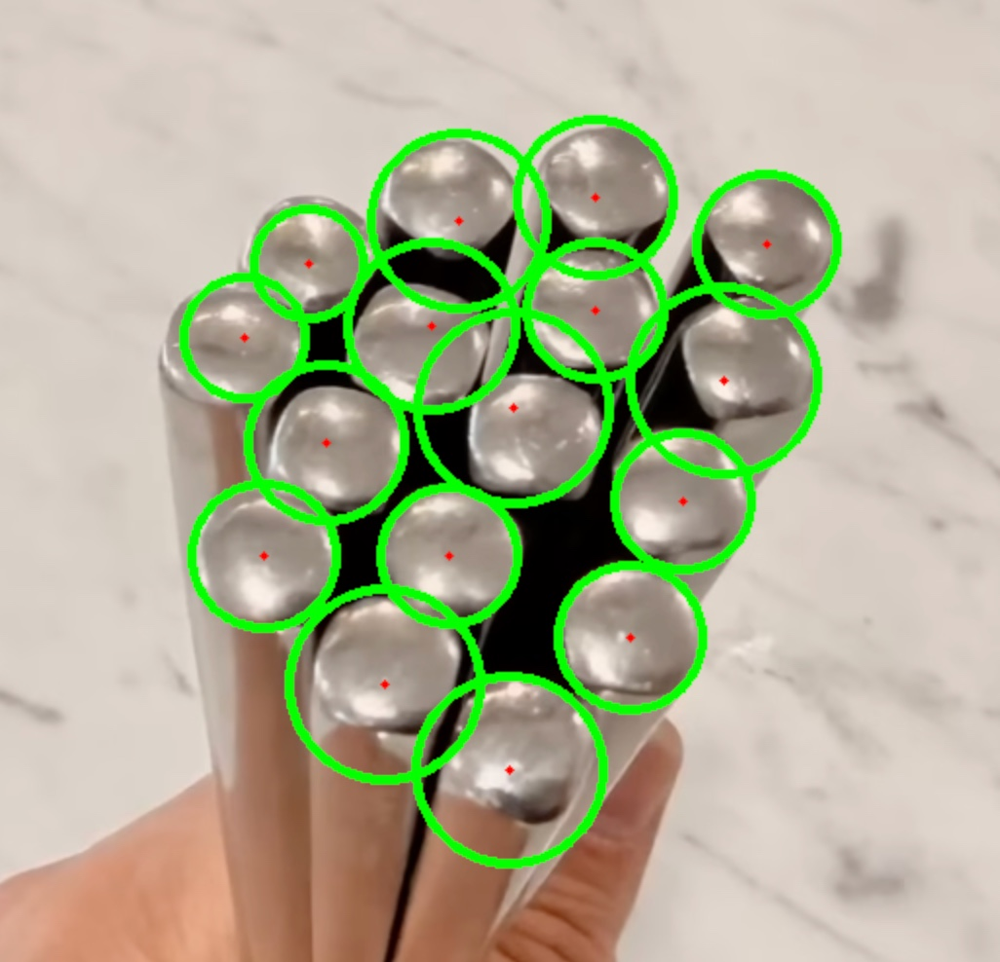
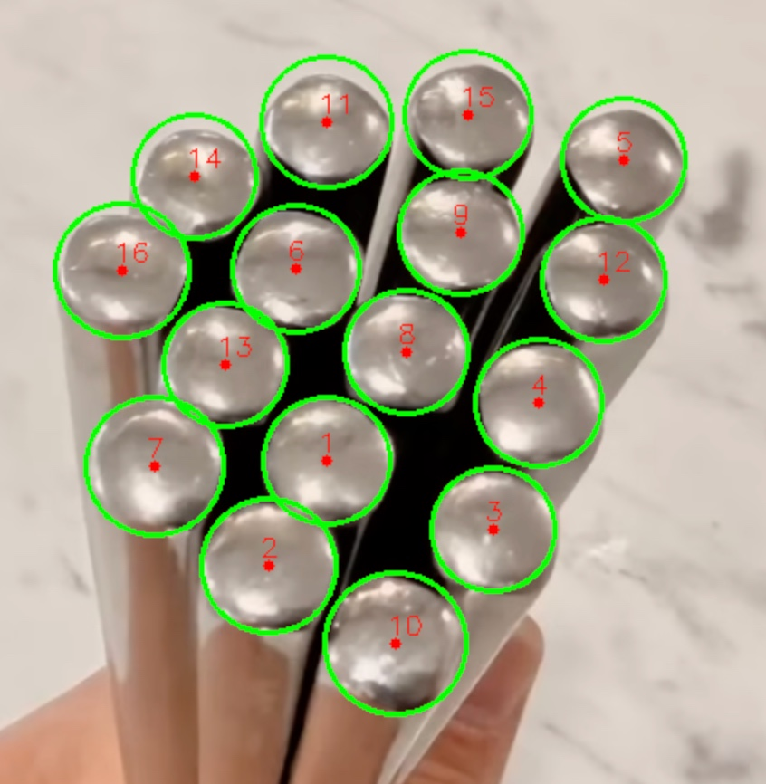

# YOLO 目标检测实战：数筷子

从传统 OpenCV 到深度学习 YOLO 的目标检测演进项目。以不锈钢筷子计数为案例，完整走通"标注→训练→推理"的闭环。

## 项目背景

不锈钢筷子头反光强、排列紧密，传统 OpenCV 霍夫圆变换在高光场景下假阳性严重、调参困难。本项目对比了两种方案，最终用 YOLO 实现了稳定检测。

| | OpenCV (霍夫圆) | YOLO |
|---|---|---|
| 检测原理 | 像素梯度、几何形状 | 深度语义特征提取 |
| 抗高光 | 差（光斑误判为实体） | 强（上下文推理） |
| 紧密排列 | 差（物体融合） | 强（多实例区分） |
| 通用性 | 差（每换场景重调参） | 强（一次训练通用） |

## 项目结构

```
yolo-detection/
├── dataset_labelme/          # LabelMe 标注的原始数据
│   ├── *.png / *.jpeg        # 原始图片
│   └── *.json                # LabelMe 标注文件（圆形标注）
├── dataset/                  # YOLO 格式数据集（由脚本自动生成）
│   ├── dataset.yaml          # YOLO 数据集配置
│   ├── images/
│   │   ├── train/            # 训练集图片
│   │   └── val/              # 验证集图片
│   └── labels/
│       ├── train/            # 训练集标注（YOLO TXT 格式）
│       └── val/              # 验证集标注
├── runs/detect/train/        # 训练输出（模型权重、评估曲线）
│   └── weights/
│       ├── best.pt           # 最佳模型权重
│       └── last.pt           # 最后一轮权重
├── out/                      # 推理结果图片
├── label_json2txt.py         # LabelMe JSON → YOLO TXT 格式转换
├── yolo_train.py             # YOLO 训练脚本
├── yolo_detect.py            # YOLO 推理 + OpenCV 精修
├── cv_detect.py              # 纯 OpenCV 霍夫圆方案（对比用）
├── pyproject.toml            # 项目依赖
└── README.md
```

## 快速开始

### 1. 安装依赖

```bash
# 使用 uv（推荐）
uv sync

# 或 pip
pip install ultralytics opencv-python numpy
```

### 2. 标注数据（可选，已有预标注数据）

```bash
pip install labelme
labelme dataset_labelme/
```

用圆形标注工具在筷子头上画圆，标签统一为 `circle1`。

### 3. 转换标注格式

```bash
python label_json2txt.py
```

将 LabelMe 的 JSON 标注转换为 YOLO 的 TXT 格式，自动创建 `dataset/` 目录结构。

### 4. 训练模型

```bash
python yolo_train.py
```

默认使用 YOLOv8n 预训练模型，CPU 训练 200 epochs。有 GPU 可修改 `device="0"`。

训练输出保存在 `runs/detect/train/`，包括：
- `weights/best.pt` — 最佳模型权重
- `results.csv` — 训练过程指标
- `confusion_matrix.png` — 混淆矩阵
- `BoxPR_curve.png` — PR 曲线

### 5. 推理检测

```bash
python yolo_detect.py
```

YOLO 检测 + OpenCV 自适应阈值精修，输出带圆形标注的检测结果。

### 6. 对比：纯 OpenCV 方案

```bash
python cv_detect.py
```

使用霍夫圆变换的纯传统 CV 方案，可与 YOLO 方案对比效果。

## 训练结果

| 指标 | 值 |
|---|---|
| mAP50 | 0.814 |
| Recall | 1.0 |
| Precision | 0.77 |
| 训练轮数 | 200 |
| 训练设备 | CPU |
| 训练图片数 | 3（过拟合验证） |

## 核心思路

### 标注策略

使用 LabelMe 的圆形标注（而非矩形框），更贴合筷子头的几何形状。转换脚本通过圆心和圆周点的距离计算半径，生成 YOLO 的矩形边界框格式。

### 检测策略：YOLO + OpenCV 混合

```
YOLO 检测（语义定位）→ 矩形框裁剪 ROI → 自适应阈值二值化 → 计算真实质心 → 画圆
```

YOLO 擅长"在哪"，OpenCV 擅长"精确到哪"。两者结合，比单独用任何一个都好。

## 效果对比

### OpenCV 霍夫圆



高光和密集排列导致大量假阳性。

### YOLO + OpenCV 精修



YOLO 语义定位 + OpenCV 亚像素精修，16 根筷子全部准确识别。

## 参考

- [Ultralytics YOLOv8 文档](https://docs.ultralytics.com/)
- [LabelMe 标注工具](https://github.com/labelmeai/labelme)
- [OpenCV 霍夫圆变换](https://docs.opencv.org/4.x/dd/d1a/group__imgproc__feature.html)
